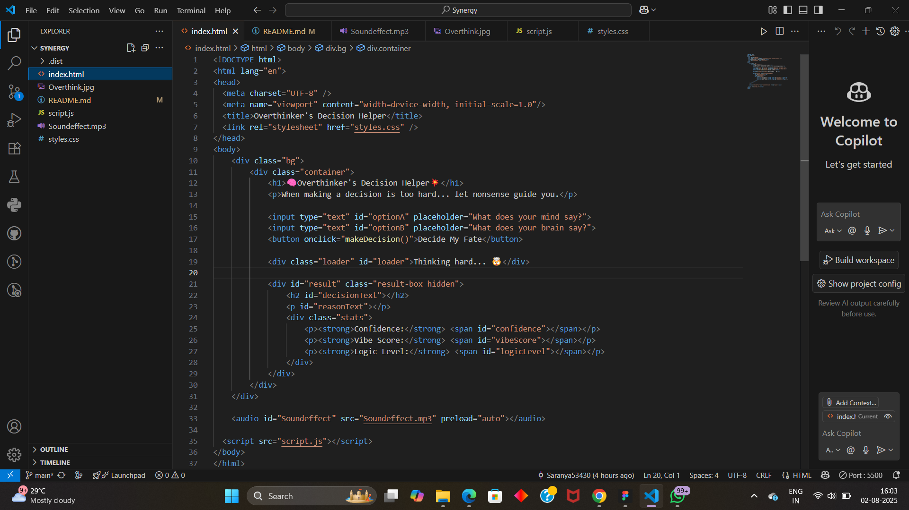
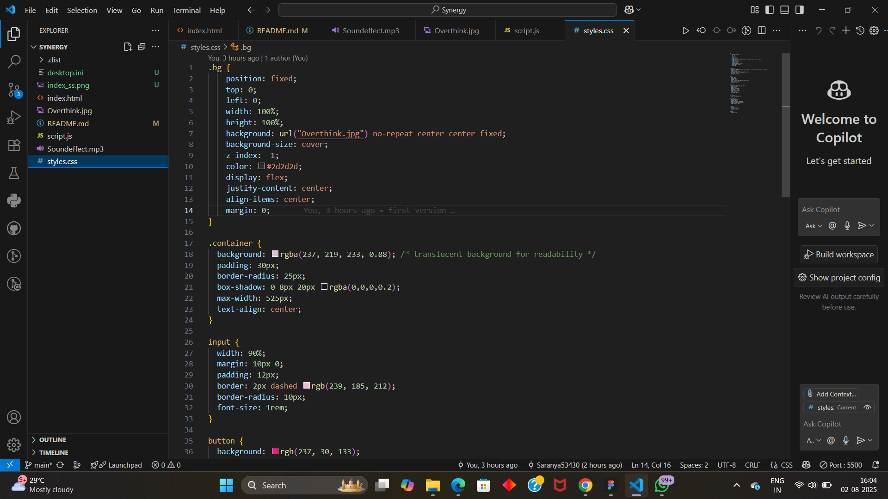
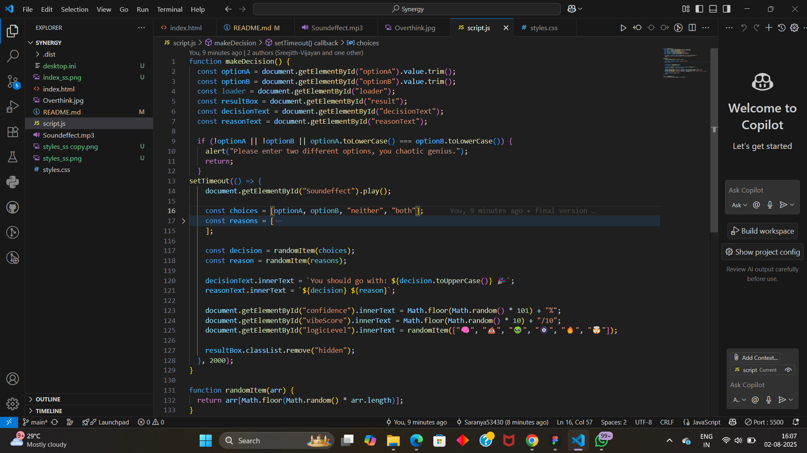

# OverThinker's Decision Helper 🎯

## Basic Details
### Team Name: Synergy

### Team Members
- Team Lead: [Saranya] - [College of Engineering Attingal]
- Member 2: [Sreejith] - [College of Engineering Attingal]

### Project Description
ThinkLess is a chaotic decision-making web app that gives hilariously random answers to your deepest life questions. Built with HTML, CSS, and JavaScript, it helps you stop thinking and start clicking

### The Problem (that doesn't exist)
People often overthink simple choices, wasting time and mental energy. ThinkLess solves this by delivering instant, absurd decisions—so you never have to think too hard again.

### The Solution (that nobody asked for)
ThinkLess provides a lighthearted tool to ease decision fatigue by offering instant choices, helping users break overthinking loops in a fun and engaging way.

## Technical Details
### Technologies/Components Used
For Software:
- HTML
- CSS
- JAVASCRIPT

For Hardware:
- [List main components]
- [List specifications]
- [List tools required]

### Implementation
For Software:
# Installation
- Git
- GitHub
- VSCode

# Run
- N/A - Just open index.html manually in any modern browser

### Project Documentation
For Software:

# Screenshots (Add at least 3)

    This is our main HTML file! It structures the Overthinkers Decision Helper Website with input fields , a fun button , result display area and an audio element for sound effects. 

    Here is our css style sheet! It brings playful visuals to life with gradient backgrounds , comic sans fonts , curved buttons and dynamic confidence bars.

    This javascript file powers the fake logic engine! It randomly picks decisions , generate silly reasons with sound effect and a 2 sec dramatic delay.

# Diagrams

*Add caption explaining your workflow*

For Hardware:

# Schematic & Circuit

*Add caption explaining connections*

*Add caption explaining the schematic*

# Build Photos

*List out all components shown*

*Explain the build steps*

*Explain the final build*

### Project Demo
# Video
<video controls src="Working_Demo.mp4" title="Title"></video>
    This is a Working Demo of our meme project. It dramatically analyzes two user inputed choices using completely random logic , fake stats and then makes a decision that might not even be related to your options.

# Additional Demos
[Add any extra demo materials/links]

## Team Contributions
- Saranya: html , javascript
- Sreejith: css , git

---
Made with ❤️ at TinkerHub Useless Projects 

